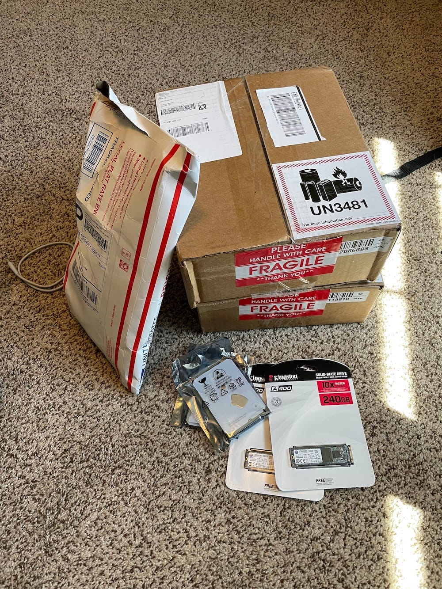
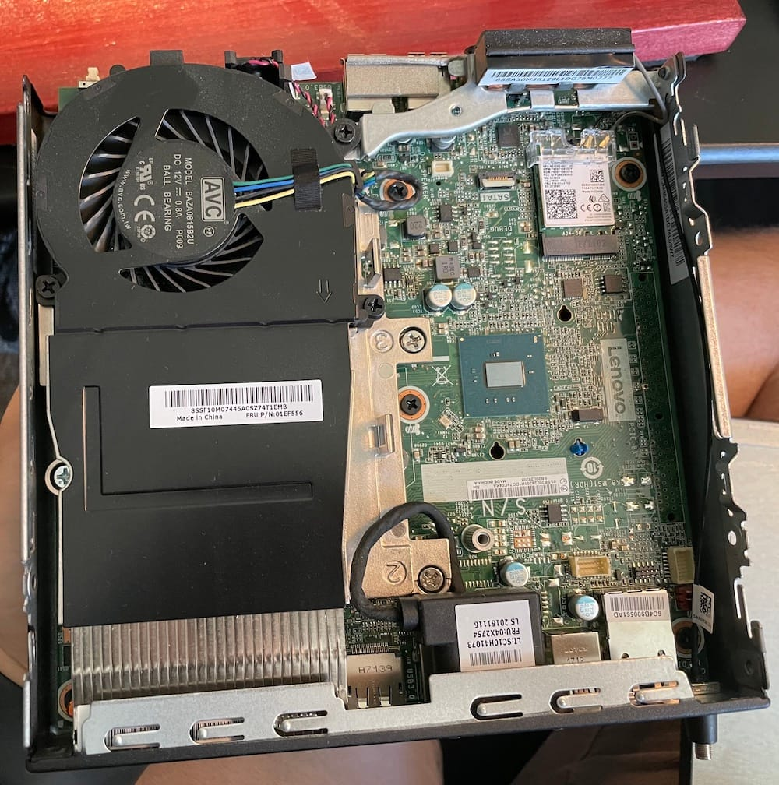
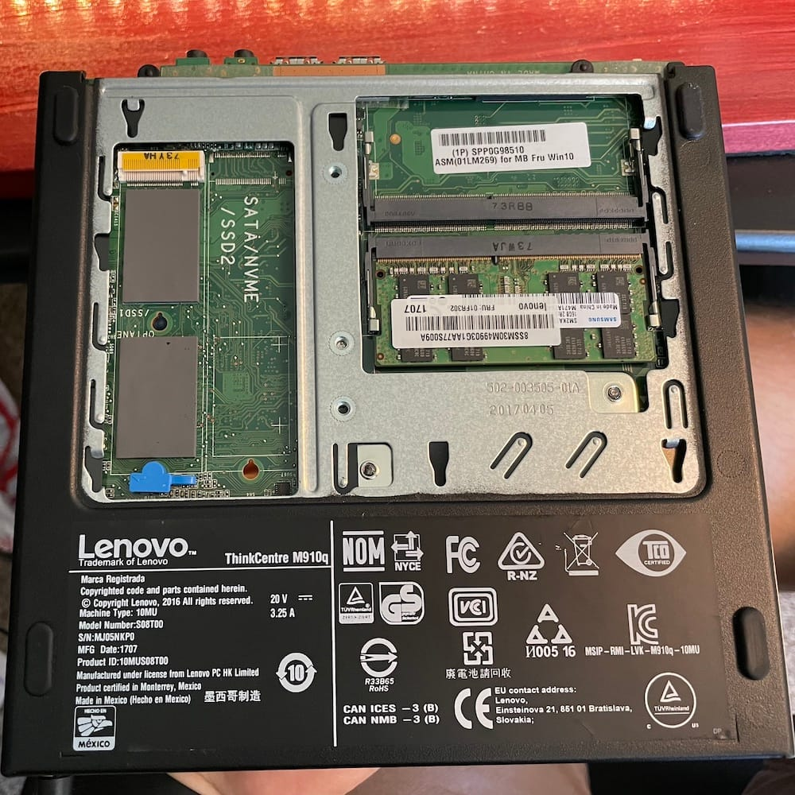

When selecting hardware, I had a few requirements:

- x86 architecture
- Affordable
- Small form factor
- Minimum features: Gigabit ethernet, decent storage, etc

After looking at lots of options, I ended up selecting a pair of Lenovo M910q's. It's a bit of an older machine, originally released in 2017, but should be more than capable for the kind of workloads I'm going to run. The tiny form factor is perfect. Small and light enough that I can zip-tie them to pegboard, but still capable enough. They both came Intel i7-7700T 2.90 GHz processors, 16 GB RAM (on a single stick, so easily upgradable in the future).

I found them on eBay without any hard drives or accessories, which made them cheaper, but meant that I had to source and buy drives, drive caddies, and power cables. Well, the packages started rolling in, which is always fun.

Christmas in June

I'll describe the process of adding the drives in later posts, but here is a picture of the inside of one of the M910Q's. It's nicely laid out, with decent cooling covering half the internal, and space for a hard drive (to be added later). WiFi comes from an M.2 form factor chip and has two antennas, one of which can be extended with an external antenna. Since these will be installed hard wired, I will disable WiFi in the BIOS and not bother with an external antenna.

Inside, with no hard drive

Underneath, another door opens to reveal the memory bay. It currently has a single 16GB chip, which means I could add an additional 16GB in the empty slot. There's also an M.2 slot for a 2280 NVMe drive. That will also get its own post. There is a silk-screen mask for a second M.2 drive slot, but no connector. I believe the second M.2 drive is available on the M910x model.

Inside the back, with no SATA drive and single memory stick

Coming up next, I'll show how to [install the hard drives](__GHOST_URL__/home-lab-build-2-installing-the-hard-drive), the challenges with the [M.2 drives](__GHOST_URL__/home-lab-build-4-m-2-drive-struggles), and [updating the BIOS/UEFI firmware](__GHOST_URL__/home-lab-build-3-updating-the-bios-eufi).
