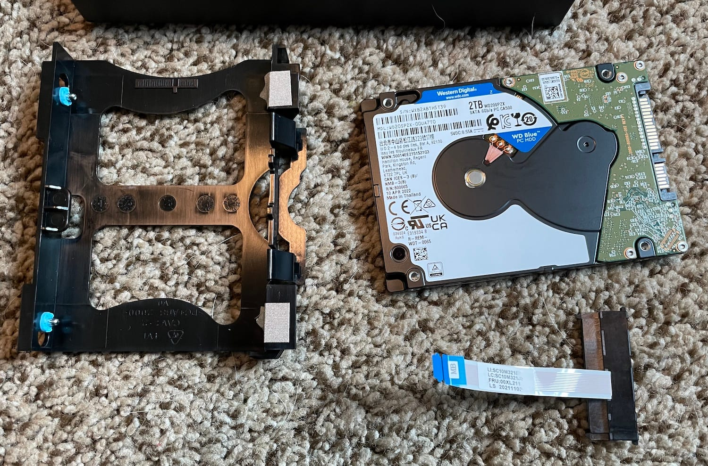
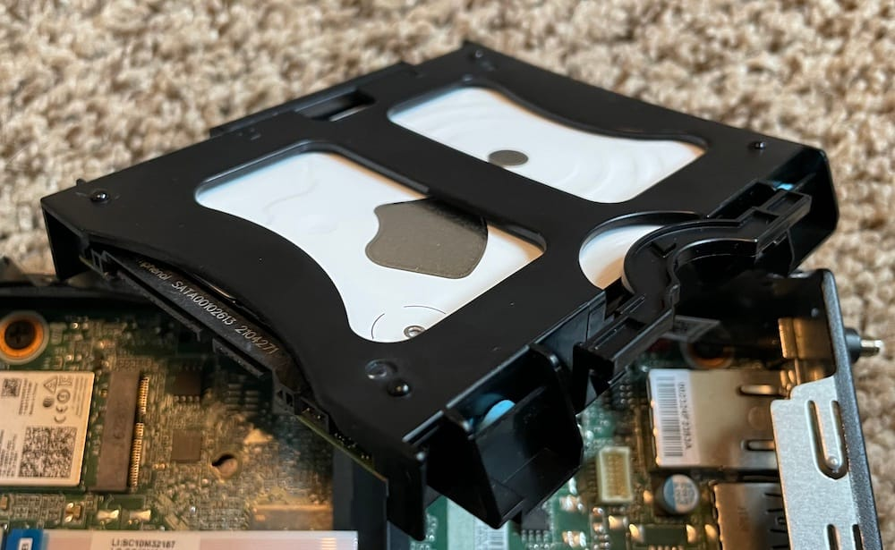
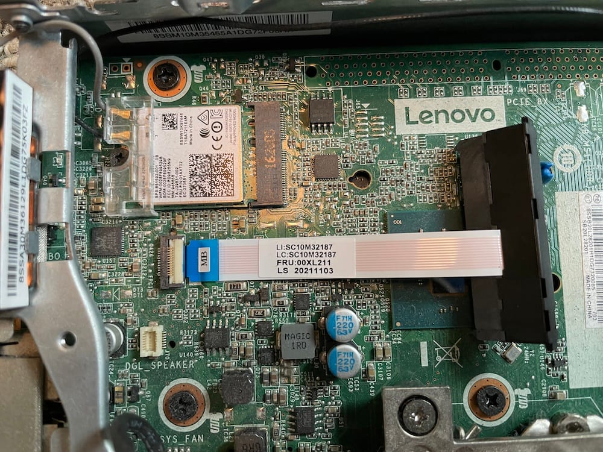
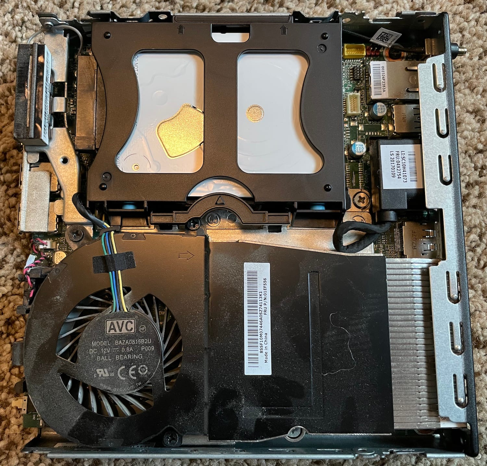

The refurbished machines I bought off eBay had no hard drives. In addition, didn't even have the caddy to hold the drive in place. I had to wait patiently while those caddies traveled to my house all the way from Hong Kong. This is a marvel of modern supply chains, and not at all an agonizing wait while I had a hard drive in one hand, and a computer missing a hard drive in the other, and no way to put the two together.

I had done enough research to learn that the M910q has enough space for 2.5" drives that are 7mm thick. I ended up purchasing a pair of [2TB Western Digital Blues](https://www.westerndigital.com/products/internal-drives/wd-blue-mobile-sata-hdd#WD20SPZX), which was a nice balance of reputation, price, and capacity.

The parts before assembly

The caddies arrived and then began the puzzle of orientation and installation. The caddy also came with a unique ribbon cable that converts from SATA and power to a 12-pin connector on the motherboard. The caddy is tool-less and snaps into the case quite easily once I determine the orientation of the cable and drive. The cables for the case fan and the DisplayPort did often get in the way.

The hard drive properly in the caddy

The SATA cable plugged into the motherboard

I was really happy with this install process. The drives were instantly recognized by the machines. The goals for these drives will be the general purpose storage, while the operating system will be installed on a separate internal M.2 drive. I'll tell the tale of that saga in a future post.

All installed
