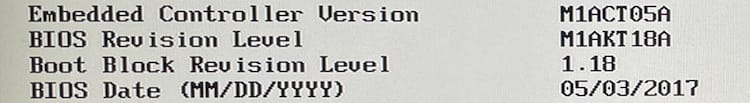
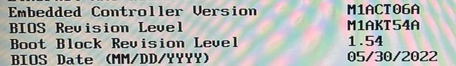

The first thing I wanted to do with the new hardware was get the BIOS updated. OK, yes, these machines don't use "[BIOS](https://en.wikipedia.org/wiki/BIOS)", but actually use "[UEFI](https://en.wikipedia.org/wiki/Unified_Extensible_Firmware_Interface)". However, I think people colloquially understand that on computers, BIOS refers to the firmware that loads before the operating system starts.

Pretty old

Why update the BIOS? Well, partly that was to fix the M.2 drive issues that I'll talk about [next time](__GHOST_URL__/home-lab-build-4-m-2-drive-struggles), but also to keep things properly up to date. The BIOS is easily downloaded from the [Lenovo support website](https://pcsupport.lenovo.com/au/en/products/desktops-and-all-in-ones/thinkcentre-m-series-desktops/thinkcentre-m910q/downloads/driver-list/component?name=BIOS%2FUEFI), but then I start running into trouble. The options for BIOS are a handful of Windows executables and a CD-ROM iso image. I don't have Windows, so that's out, and I don't think I had a burnable CD on hand for fifteen years. This took me nearly all day to figure out how to do this.

I attempted to use various websites to use the CD image on a USB thumb drive, not that didn't work. When booting, I kept getting 1962 POST errors, meaning that the computer was not able to detect a drive to boot from. I got some blank CDs from a neighbor. Turns out those CDs had the [Twilight soundtrack](https://en.wikipedia.org/wiki/Twilight_(soundtrack)) on it... No judgement, it's got some bangers on it. I even tried getting a bootable Windows USB thumb drive to try and use the Windows utilities above... no dice. The closest I got was getting a bootable Ubuntu drive and using the fwupdmgr utility, but that didn't see any Lenovo updates.

It wasn't until reading through the comments of [one of the pages](https://workaround.org/article/updating-the-bios-on-lenovo-laptops-from-linux-using-a-usb-flash-stick/#:~:text=1%20Go%20to%20support.lenovo.com%28or%20better%20use%20a%20search,refuse%20to%20update%20otherwise.%29%2013%20Follow%20the%20instructions.) I had consulted did I find the solution. The bootable CD requires these changes to UEFI:

- Turn off secure boot
- Enable UEFI/Legacy boot

After that, it booted right up into the UEFI update CD and the update went flawlessly. Yes, I drove my car to OfficeMax and bought burnable CDs. Living like it's 2007 again.

Nice and new
