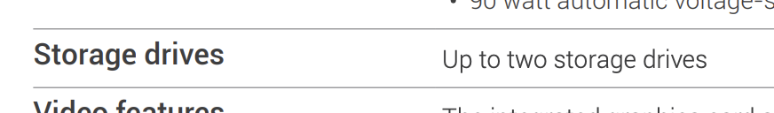
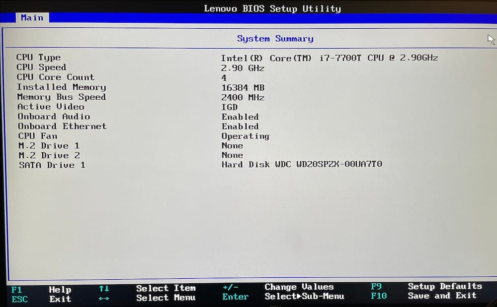
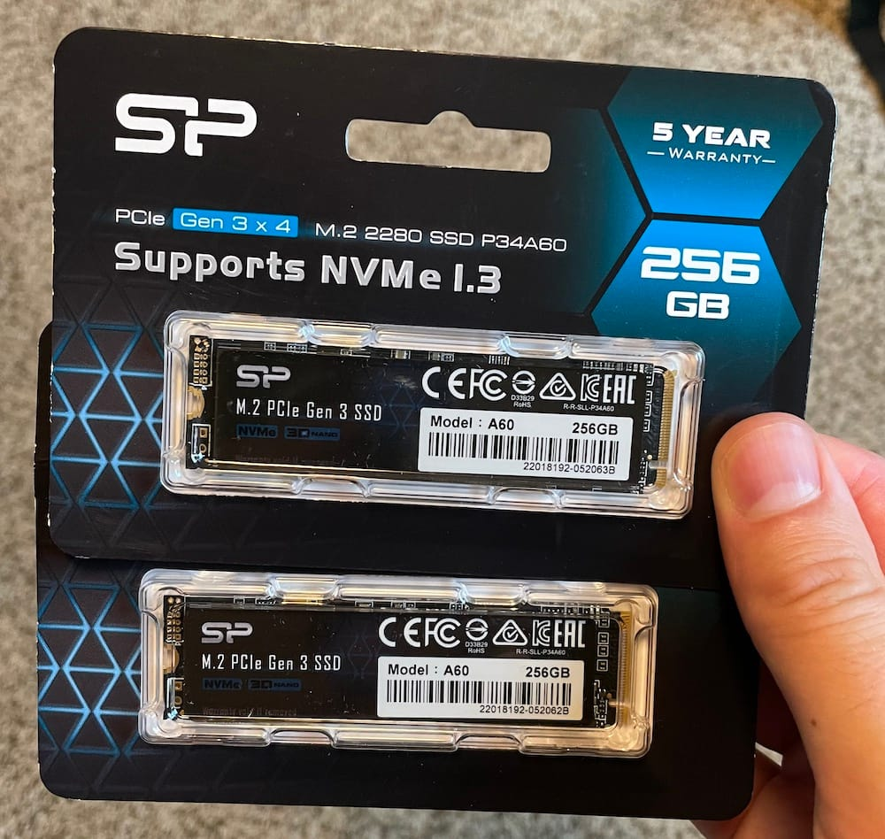
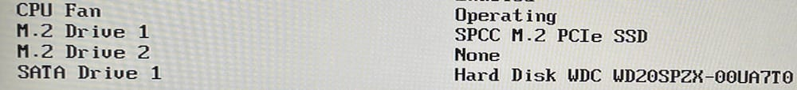

The M910q has space for two drives, a 2.5" SATA drive and a 2280 M.2 drive. This is great, because the plan will be to put the operating system on the fast M.2, and use the spinny drive to store persistent data. However, picking drives to put in the machines proved harder than it should have been. The official specs don't say much more than "yes drives":

I had to freeze-frame YouTube videos of people installing drives to find out that the 2.5" drive needs to be 7mm, and the M.2 drive is the 2280 size. I detailed the install of the hard drives in an [earlier post](__GHOST_URL__/home-lab-build-2-installing-the-hard-drive).

For my lab, I purchased a pair of [Kingston A400 240GB](https://www.kingston.com/en/ssd/a400-solid-state-drive?partnum=sa400m8%2F240g) SSDs and popped them in. Installing an M.2 drive is remarkably simple and satisfying. I just slides right in and you're done. That, I will find, was the easiest part of the process. Immediately, I knew I had trouble when it didn't show up on the devices list in the BIOS.

M.2 Drive 1: None?

I thought, maybe updated BIOS would help. I wrote about that journey in the previous post. Nope. The drive still wasn't recognized. I thought, maybe Kingston has new firmware for this drive. Nope, they do for the 2.5" A400 SSD, but not the M.2 one. I nearly gave up, until I was reading through forums and found [this post](https://forums.lenovo.com/t5/ThinkCentre-A-E-M-S-Series/M910-Tiny-total-number-of-M-2-and-SATA-SSD-slots/m-p/4229947?page=1#4230394), specifically the comment that said:

> ...that M.2 card is SATA only, it will not work in the M.2 slot, which is PCIe only.

My A400's are SATA drives, not PCIe... Luckily I hadn't spent too much money on them.

Next, I purchased a pair of [Silicon Power 256GB P34A60](https://www.silicon-power.com/web/us/product-P34A60)'s, popped them in and they just worked on the first boot.

Success!
