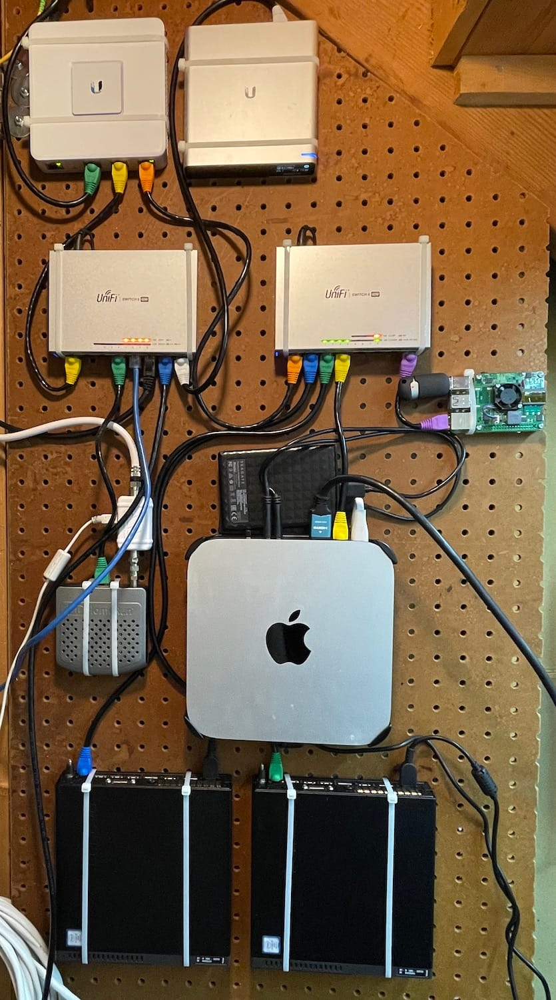

Getting computers to boot is nice, but they need software to run. For my lab, I knew I was going to put them together as a Kubernetes cluster. I want to minimize hand-tuning the actual machine and rely on Git-ops where I can. Hopefully, if I have to rebuild a node, it's less painful to do so. Hopefully, I'll never have to test that theory.

About a year ago, I tried a number of different Kubernetes platforms, looking for one that I could use to link the old Raspberry Pi and MacMini (my first iteration of a home lab). Unfortunately, most of the available platforms that would run on Mac didn't really make it easy to run multi-node clusters. Of all the ones I tried, I liked the experience of [Microk8s](https://microk8s.io/) the best, and I ran that as a single-node cluster on the Raspberry Pi.

For the new lab, I opted to keep using Microk8s, since it worked well for me in the past, and since it provides packages that adds the additional functionality I wanted.

The home lab all in its place

### Setting up the Lenovo M910q nodes

Since I'm using Microk8s, I'll be using [Ubuntu 22.04 LTS (Jammy Jellyfish)](https://www.releases.ubuntu.com/22.04/). the process of installing Ubuntu and getting Kubernetes running was simple:

1.  Download the ISO for the [Ubuntu server installer](https://ubuntu.com/download/server)
2.  Use Balena Etcher to flash a USB thumb drive with the ISO
3.  Boot the computer into that drive and start the installer
4.  During the installer, there were only a few things I did other than the defaults:
5.  Partition the two drives: the M.2 SSD having `/` and the HDD having `/data`
6.  Preinstall the `microk8s` and `docker` snap packages
7.  Reboot!

After the first boot, it's always good to update the OS and packages, and deploy a few of my favorites:

    sudo apt update && sudo apt upgrade
    sudo apt install jq net-tools vim

    wget -O- https://carvel.dev/install.sh > install.sh
    sudo bash install.sh
    rm install.sh

### Setting up Host Path

By default, Microk8s stores PersistentVolumes using the hostpath-storage add on at /var/snap/microk8s/common/default-storage. This would put it on the M.2 drive, but I want it to go on the HDD. I did a little trick:

    sudo mkdir /data/cluster-storage
    sudo chown kubernetes:kubernetes /data/cluster-storage/
    cd /var/snap/microk8s/common
    sudo rm default-storage
    sudo ln -s /data/cluster-storage default-storage

**UPDATE**: I don't do this anymore, because I [stopped using the M.2 drive as my root partition](__GHOST_URL__/home-lab-6-quick-update-about-volumes/).

### Setting up High Availability

Using [High Availability](https://microk8s.io/docs/high-availability) in Microk8s has some great advantages: The cluster stays online if a node fails, and I can issue `kubectl` commands to any node. I had two computers, so I needed to add a third node. I remembered that I ran Microk8s on my Raspberry Pi. If I added that back to the cluster, I could enable HA.

I did a fresh install of Ubuntu Jammy on the Pi using the [Raspberry Pi Imager](https://www.raspberrypi.com/software/). Much like before, update the packages and `sudo snap install microk8s`.

Now that the Pi is part of the cluster, I reconfigured my router to send traffic meant for the cluster to that node as the primary ingress route. However, that didn't fix thing and started seeing nginx issues. Using [Octant](https://octant.dev/), I found there were issues with the Calico pod on the Pi. [Calico](https://projectcalico.docs.tigera.io/about/about-calico) is a container networking solution that Microk8s uses to direct traffic within the cluster. Turns out, there's a [known issue](https://microk8s.io/docs/troubleshooting) with Calico on the Pi that's solved by installing a single package.

### Conclusions

It's been running fairly stably for a few weeks now. One of the Lenovo nodes is having trouble with filesystems, and I'll troubleshoot that in another post.

I documented the full setup steps in my [cluster GitHub repository](https://github.com/petewall/cluster/tree/main/setup). It's more for my benefit of knowing what I did to set things up, but maybe it'll benefit someone else.
