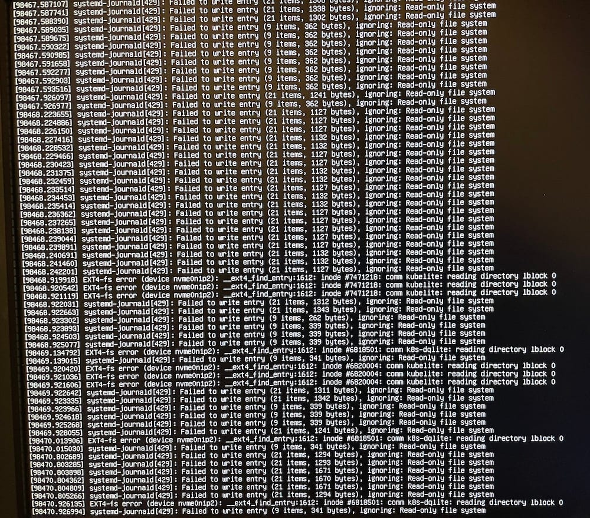

I have been running the lab for several weeks now and some of the gremlins are starting to show themselves. No platform is 100% stable, so I certainly expected to find things to fix here and there, but this one started falling apart quite quickly.

It started with one node suddenly not responding to `ssh`. Rebooting got things working again, but typically, it'd stop responding within 24 hours. Attaching a keyboard and monitor to the machine, I was flooded with journald messages like this:

Issues reported by systemd-journald

Searching for answers for the issue, I found [this](https://askubuntu.com/questions/1173738/crash-systemd-journal-failed-to-write-entry-ignoring-read-only-file-system-on), which looked very similar. Notably, the asker mentioned the issue starting "once in a while", and its fixed with a reboot. Also notable, is the presence of an SSD drive.

The two answers are:

1.  Upgrade your kernel, but given this is a fresh install of Ubuntu, I'm already at the latest.
2.  Update the firmware of your SSD. Basically, Ubuntu does a process called "fstrim", which periodically marks unused data segments on a drive as able to be deleted. During this process, the file system gets locked, but since its the root partition, journald is trying to write entries, we see the above issues.

Unfortunately, my Silicon Power SSDs are not on [fwupd](https://fwupd.org/), and of course, the [firmware updater](https://www.silicon-power.com/web/us/firmware) from the manufacturer, only works on Windows.

My apologies for anyone finding this post looking for an answer. I took the easy way out: I re-installed Ubuntu with the HDD as the root partition. The SSD is mounted, but basically unused.

One cool thing: since the Micr0k8s cluster was in HA mode, once the node was running again, I joined the cluster and the workloads just kept running. After all this, I'll be happy to start posting about real work, not trying to get some computers working!
