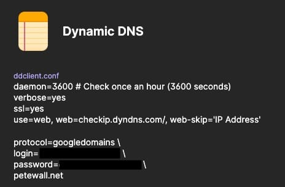
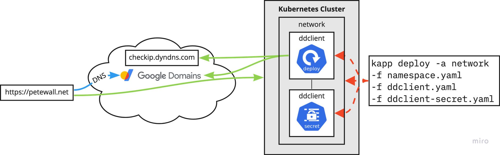
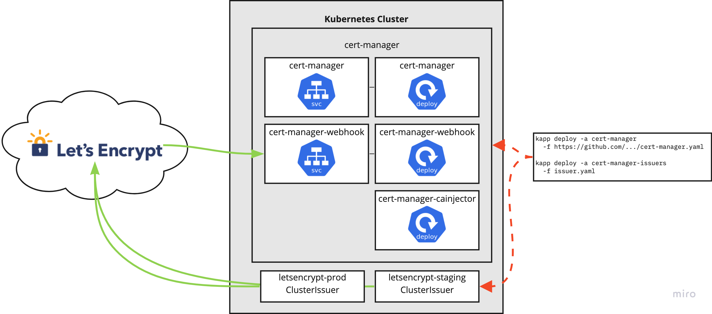
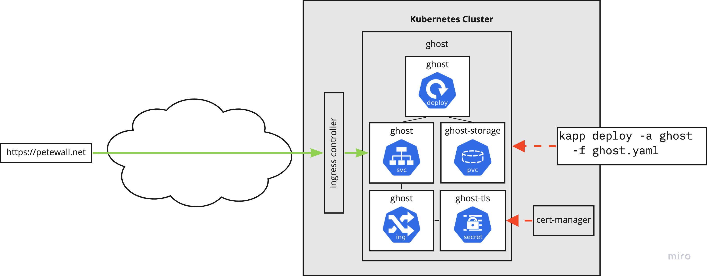

Up until now, all of my posts have been about the process of setting up my home lab. I wanted to document this to collect my thoughts about how it all started, the progress I made, and to capture the issues I encountered and how to solve them. This blog became part of the process for two reasons: I could work on some technical writing and communication skills, and the technical details of deploying the blog could be a good use-case of the lab resources.

I chose to run [Ghost](https://ghost.org/), because it is open source, has a clean user interface, and lends itself well to being deployed on Kubernetes. But there's more to running petewall.net than just deploying Ghost in a container on a computer in my basement.

### Network setup

The first task is getting `petewall.net` to map to my home network. My domain is registered with [Google Domains](https://domains.google/) which supports using [Dynamic DNS](https://en.wikipedia.org/wiki/Dynamic_DNS) to set IP address A records. DDclient is a utility that can communicate with Google using the Dynamic DNS protocol to set those records with the command line. But why do something manually when you can automate the process?

The deployment is based around the [Ddclient docker image](https://docs.linuxserver.io/images/docker-ddclient) from LinuxServer.io, which reads its configuration using the `ddclient.conf` config file. My specific `ddclient.con` lives as a secure note in my 1Password vault, which is then used to generate a Kubernetes secret. That secret (with the config file inside) is mounted as a volume in the Ddclient pod.



1Password secret with my ddclient.conf

Once deployed, this pod will get the public IP address of my home network, then update the DNS records on Google.



DDclient updating Google Domains' DNS records

The DDclient deployment is captured on my GitHub repository: <https://github.com/petewall/cluster/tree/main/deployments/network>

### Certificate management

The second task is getting proper SSL certificate management working. In today's world, there's no reason not to support HTTPS, and with services like [Let's Encrypt](https://letsencrypt.org/), getting a proper cert is very easy. But again, why do something manually when you can automate the process?

[Cert Manager](https://cert-manager.io/) is a certificate controller that can automatically provision certs from various certificate authorities. What's great for my home lab use is its ability to provision certs from Let's Encrypt. This process automatically happens when I add a `tls` section to any Ingress object.



The Cert Manager deployment working with Let's Encrypt

The Cert Manager deployment is also captured on my GitHub repository: <https://github.com/petewall/cluster/tree/main/deployments/cert-manager>

### Ghost deployment

Finally the infrastructure is in place to do something real! Ghost does not have an official deployment path for Kubernetes, but they do have [docs](https://ghost.org/docs/install/docker/) for their official [Docker image](https://hub.docker.com/_/ghost/). That's nearly just as good. Using those docs as well as some resources from other [people's blogs](https://teilin.net/getting-started-with-kubernetes/), I was able to come up with a pile of YAML that I can deploy for a pretty stable blog platform!



Ghost deployed on Kubernetes

Because the Ingress object has the `tls` section, Cert Manager automatically talks with Let's Encrypt to provision the SSL cert. This is stored in a Kubernetes secret, which is then used during HTTP requests to the service.

``` yaml
apiVersion: networking.k8s.io/v1
kind: Ingress
metadata: {...}
spec:
...
  tls:
  - hosts:
    - petewall.net
    secretName: ghost-tls
```

As with the others, my Ghost deployment is captured on my GitHub repository: <https://github.com/petewall/cluster/tree/main/deployments/ghost>

### Final thoughts

You may have noticed in the diagrams that I describe using [`kapp`](https://carvel.dev/kapp/). `kapp` is a part of the [Carvel](https://carvel.dev/) suite of tools, where it deploys Kubernetes resources, bundled together, as "applications". In my opinion, `kapp` hits the sweet spot between ease of use and excellent functionality.

When compared against `kubectl apply -f` , `kapp` has two features that I love:

- `kapp` will not finish until the resources have resolved. Did you create a deployment? `kapp` will wait until the pods are running. This is helpful in finding issues well before running a bunch of get's and describe's.
- `kapp` will keep all the files you deployed "bundled" together as an app using annotations. This means removing the app will remove all pieces, and I don't have to remember exactly which files I applied.

The next comparison would be with [Helm](https://helm.sh/), since that also installs and uninstalls as a package. However, in my opinion, Helm is trying to do three things at once. It's a bundling format, it's a templating system, and a package manager. `kapp` is not all of those, but it does what it's supposed to better. The files I deploy with `kapp` are identical to the one's I can use with `kubectl apply -f`, so it's already much easier to make. The templating is done better by [ytt](https://carvel.dev/ytt/) anyway.

This is my opinion. Helm is very popular, so if you love it, go for it. I'll keep my `kapp`.
