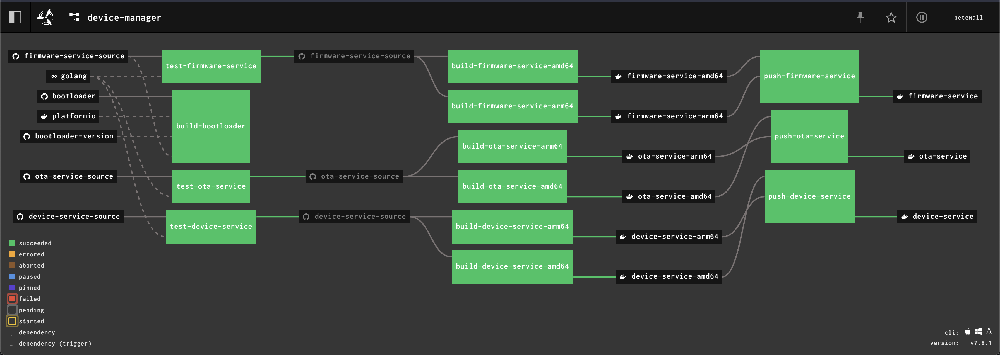
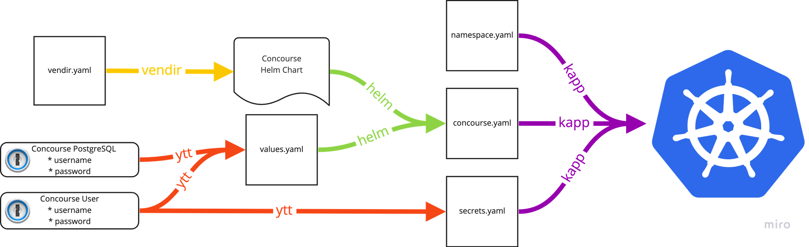
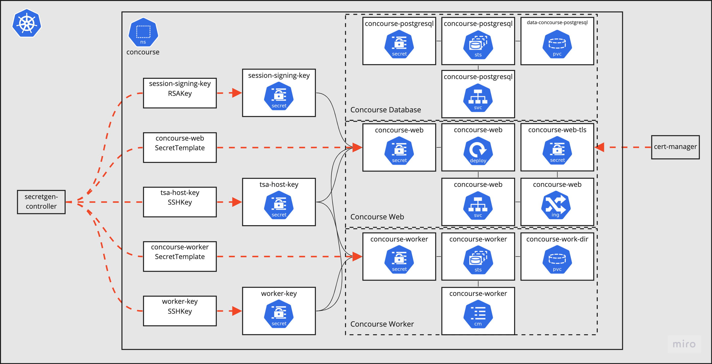

Continuous testing, integration and deployment tools have come a long way. In my early career were with organizations that used simple tools like cron to just run a thing at a certain time. At another organization, I installed my own deployment of [Hudson](https://en.wikipedia.org/wiki/Hudson_(software)) and set up the first continuous test builds for my team. For a long period of time, I worked at places too small to really require build automation. Then, while working at Pivotal, I was introduced to proper build and deployment automation using [Concourse](https://concourse-ci.org/).

### Concourse?

Concourse shines in a few ways that other CI/CD tools still don't. First is its ability to visualize a pipeline. This makes it simply to identify failures and see what impact they'll have downstream. For most tools, the dashboard feels like an afterthought, a way to HTML-ify the command-line output. But with Concourse, the user experience is primary.



A Concourse pipeline

Second is its flexibility. One could argue that Concourse is a container image runner, with some scheduling rules. Often, no special container images need to be built to be used by Concourse. Third, and this is a bit subjective, it's one of those tools that just feels like a delight to use.

There are a few ways to deploy Concourse:

- Running the database and CLIs manually. Not what we do here.
- A [BOSH](https://bosh.io/) release. I still know some BOSH, which is more than the average enterprise engineer, but I'm going that route.
- Using [Docker Compose](https://docs.docker.com/compose/). I ran this on the Mac Mini for a long time until a Docker Desktop upgrade broke things. Also, not what we're doing here.
- A Helm chart, which intelligently deploys to Kubernetes.

The last option using the chart gets me the closest to what I want, but as I talked about in the [previous post](__GHOST_URL__/summoning-ghosts/), I'm not the biggest fan of Helm charts. I haven't yet used any charts in my cluster and I didn't want to start using multiple package managers.

### Concourse and Carvel

So, what should I do? Build deployment YAMLs from scratch? That won't work, because I don't want to be re-writing what's already in the chart. The Concourse authors wrote the chart with purpose and are keeping it up to date. Let's use the chart, but only as a delivery vehicle for the Kubernetes objects that need to be made.

Breaking away from the chart allows for some advantages. I can use [kapp](https://carvel.dev/kapp/) for deploying Concourse as an app. Even better, I'm able to enforce a few security best-practices:

- Usernames and passwords that I need to know live in 1Password, never on git.
- Usernames and passwords that should not change (i.e. database passwords) live in 1Password, and never get regenerated.
- Other secrets that I don't need to know can and should be regenerated freely.



The process of deploying Concourse using various tools

Here's how I ended up putting it all together:

1.  I used [vendir](https://carvel.dev/vendir/) to get a specific version of the Helm chart. This gives me a local version to use and ensures that it doesn't change without my knowledge.
2.  Next, passwords are fetched by the [1Password CLI](https://developer.1password.com/docs/cli/), and merged into a `values.yaml` file with [ytt](https://carvel.dev/ytt/).
3.  This values file is used with the chart to render the full set of Kubernetes deployment objects into a single file, `concourse.yaml`.
4.  ytt is used again to populate a `secrets.yaml` file, more on that later.
5.  All files are deployed to the cluster as a single application using [kapp](https://carvel.dev/kapp/).

### Don't tell me secrets I don't need to know

One of the best parts of this process lives in the [`secrets.yaml`](https://github.com/petewall/cluster/blob/main/deployments/concourse/secrets.yaml) file. Concourse uses a handful of RSA and SSH keys to protect the communication between its services. With the Helm chart process, the keys are defined in the values file, so that means they're either committed to git (eww), or I have to generate them, store them somewhere and then apply them when deploying the chart. It's a lot of work and potential for security leaks for secrets that I don't care about.

Introducing, the fourth Carvel tool I'll talk about in this post, [secretgen-controller](https://github.com/vmware-tanzu/carvel-secretgen-controller). secretgen-controller is a set of CRDs and an operator that monitors for a set of objects, which are secret generators of different secret types. Instead of making and deploying a secret, I can just say "I want a random password of length 50", and secretgen-controller will create it for me.

Concourse needs a handful of secrets, and conveniently, its Helm chart has a switch that will skip creating them. I need only to add this to my `values.yaml`:

``` yaml
secrets:
  create: false
```

Since the chart won't create the secrets, I'm allowed to create them myself. The `secrets.yaml` file in my deployment repository contains definitions like the following which secretgen-controller will turn into a new, randomly generated, SSH key:

``` yaml
---
apiVersion: secretgen.k14s.io/v1alpha1
kind: SSHKey
metadata:
  name: worker-key
  namespace: concourse
spec: {}
```

Rinse and repeat for the other keys and all of the required secrets will be created when the application is deployed. Even better, since the whole thing is deployed with `kapp`, I can trust that things will resolve in the right order, no matter the inter-object dependencies.

### Ready to fly



Architecture diagram of Concourse along with generated secrets

The full detail of my Concourse deployment is captured in my GitHub repository: <https://github.com/petewall/cluster/tree/main/deployments/concourse>
