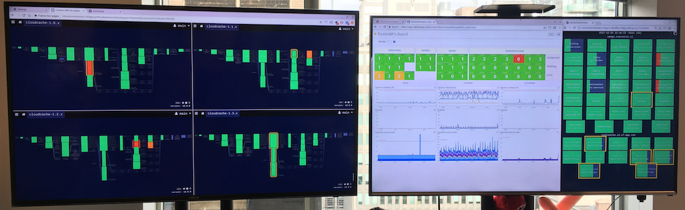
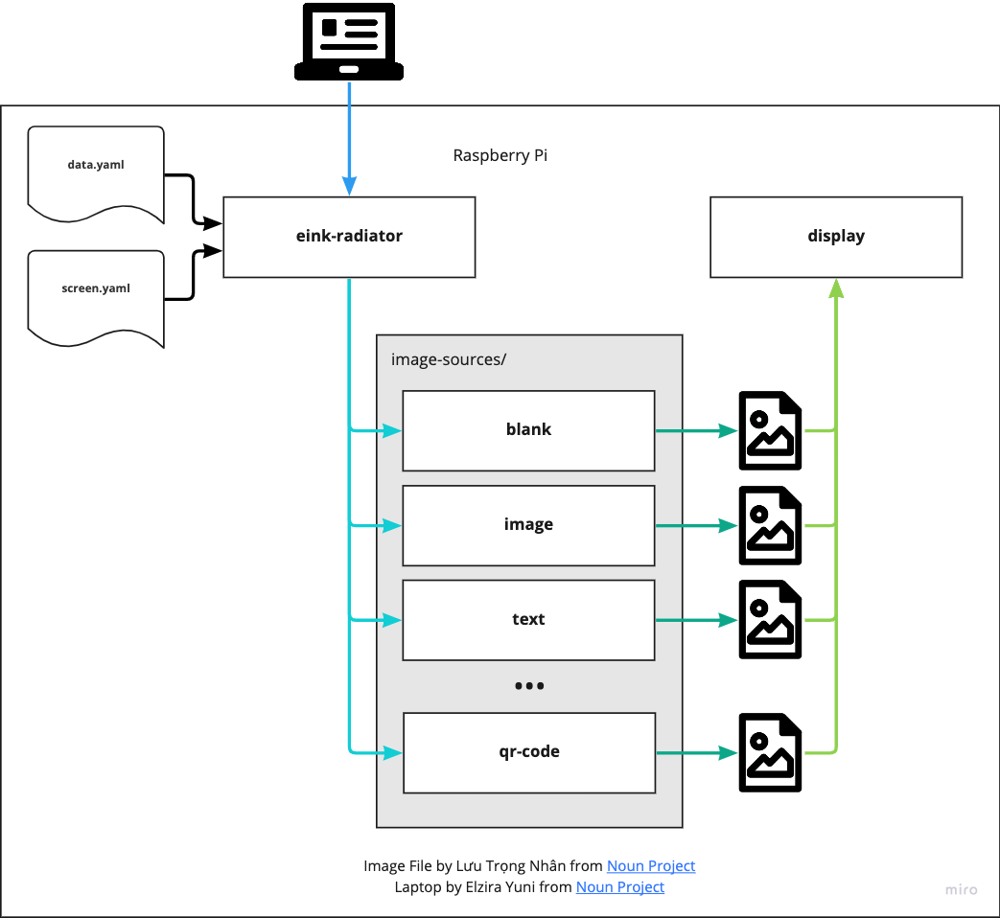

I recall learning about test-driven development the first time. Way back when I was an Associate Software Engineer at Spanlink. Like many people, it didn't make sense at first. "Test something that doesn't exist? What's the point in that?" Exactly! Clearly, I got it because years later, at Symantec, I championed TDD for developing new features. My claim to fame was a feature delivered with only one bug reported (an absurdly long string was used by the customer). That bug was quickly found and fixed with a new test in place.

At Pivotal, I encountered a whole new layer of testing with proper Continuous Integration and Continuous Delivery pipelines. Many teams were using [Concourse](__GHOST_URL__/continuous-thing-doer) to test and deploy their code, but some folks in Pivotal offices set up things called radiators.

A Concourse radiator ([Source](https://blog.concourse-ci.org/designing-a-dashboard-for-concourse/)).

A CI/CD radiator is basically a display set high up enough for everyone to be able to see, that shows the current status of the CI/CD pipelines. Normally, they're all green, but when something goes red, it makes it easy to catch people's attention. This aids in proactively dealing with issues as well as a shared sense of ownership in the quality of the product.

In those days, I was pairing with another remote engineer who was just as interested in electronics and gadgets as I am. While browsing [Adafruit](https://www.adafruit.com/) as one does, I discovered the [Pimoroni InkyWhat](https://shop.pimoroni.com/products/inky-what?variant=21441988558931), a three-color eInk display that can display black, white, and red! It'd be perfect for a small personal radiator because normally it'd be an unobtrusive black and white, but when it goes red, I know something needs my attention.

The 3-color Pimoroni InkyWhat ([Source](https://learn.pimoroni.com/article/getting-started-with-inky-what)).

The screen plugs directly into a Raspberry Pi and provides its own [Python library](https://pypi.org/project/inky/), which makes it very easy to program and deploy. Now, in fact, I've already done a lot of work on this project, but I wasn't happy with the direction it was taking. More monolithic, less velocity, less flexible. So, I'm throwing away (mostly) the existing code and starting over with a new design. This post shows the new design and I'll elaborate on the new components in future posts.

The new eInk Radiator design.

The new system will consist of three main components:

- A collection of image sources. These are simple binaries with a standardized interface, that take a set of config files and output an image of a specified size. For example, a `weather` image source could take in config with geo-spatial coordinates and output a screen with a weather forecast for that location.
- A display binary, which takes an image and displays it on the eInk display.
- The eInk Radiator binary, which schedules the generation of images, the displaying of those images to the screen, and hosts a web UI where the user (me) can configure the order and duration of the images.

Clearly this has gone beyond just a simple CI radiator and into a generalized image generation and display system. What fun is a side project without it going way beyond what I originally expected?
