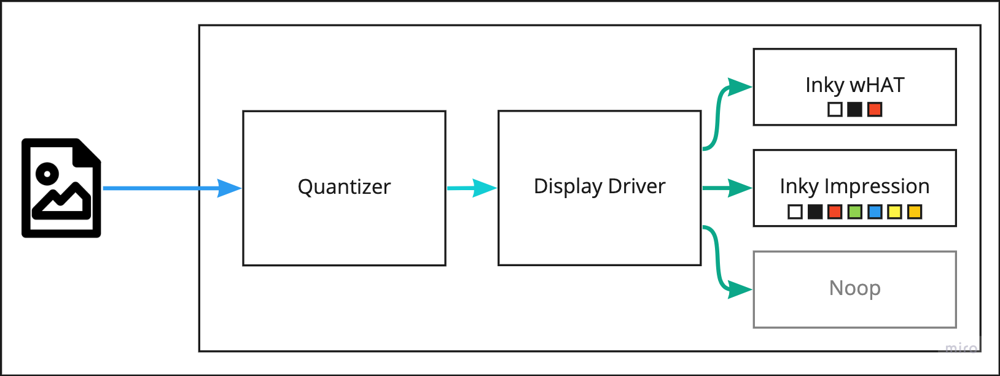
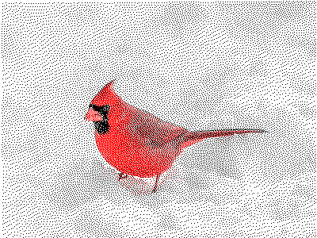
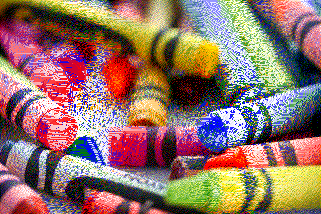
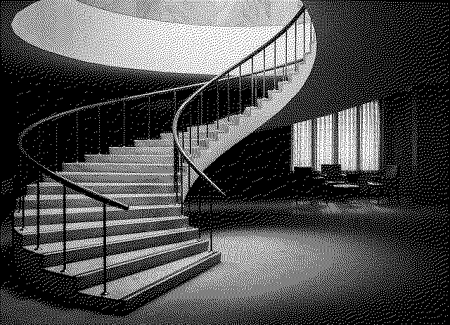
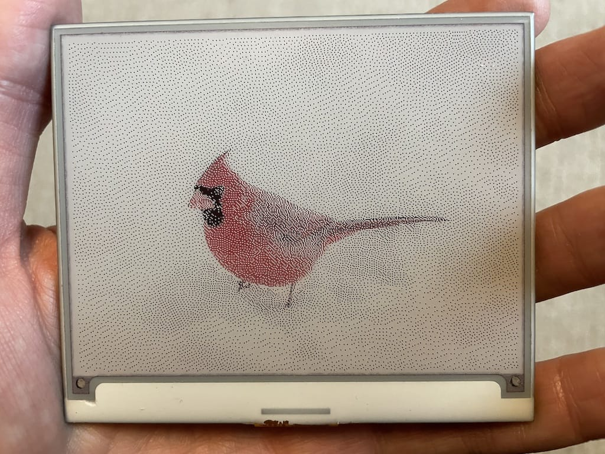

The heart of this project is the eInk screen, a red, black, and white screen from Pimoroni called an [InkyWHAT](https://shop.pimoroni.com/products/inky-what?variant=13590497624147). It's extemely simple to use, because it connects to a Raspberry Pi through it's GPIO header. Pimoroni has published a Python driver in [GitHub](https://github.com/pimoroni/inky/) and [PyPI](https://pypi.org/project/inky/), which abstracts away all of the bit bashing to get the hardware to work and just takes a [PIL](https://python-pillow.org/)-style image object.

In the spirit of the modularized nature of the eInk Radiator project, the display module is a simple CLI. It takes an image as input, quantizes it down to the supported color palette, then displays the image on the hardware screen.

Architecture for the display module

The [quantization](https://en.wikipedia.org/wiki/Color_quantization) is the important piece, since the screens only support a limited color palette, the image needs to be reduced to only the supported colors. When done well, the resulting image can look very close to original. The CLI utilizes Pillow's Image [Quantize](https://pillow.readthedocs.io/en/stable/reference/Image.html#PIL.Image.Image.quantize) function, which supports [Floyd-Steinberg dithering](https://en.wikipedia.org/wiki/Floyd%E2%80%93Steinberg_dithering). I'm always impressed at how good the resulting images look.

Quantized to white, black, and red for Inky wHAT displays. Photo by [Patrice Bouchard](https://unsplash.com/@patriceb?utm_source=unsplash&utm_medium=referral&utm_content=creditCopyText) on [Unsplash](https://unsplash.com/?utm_source=unsplash&utm_medium=referral&utm_content=creditCopyText).

Quantized to black, white, red, green, blue, yellow, and orange for Inky Impression displays. Photo by [Sonya Lynne](https://unsplash.com/@sonyalynne?utm_source=unsplash&utm_medium=referral&utm_content=creditCopyText) on [Unsplash](https://unsplash.com/?utm_source=unsplash&utm_medium=referral&utm_content=creditCopyText).

Quantized to white and black for plain eInk displays. Photo by [Serhat Beyazkaya](https://unsplash.com/@serhatbeyazkaya?utm_source=unsplash&utm_medium=referral&utm_content=creditCopyText) on [Unsplash](https://unsplash.com/?utm_source=unsplash&utm_medium=referral&utm_content=creditCopyText). Giving major [HyperCard](https://en.wikipedia.org/wiki/HyperCard) vibes.

The result is an image that is properly paletted to the display. Here is the cardinal picture above displayed on the white, black, and red Inky wHAT. The simulation of the orange beak still blows my mind!

The source code is available on [GitHub](https://github.com/petewall/eink-radiator-display).
