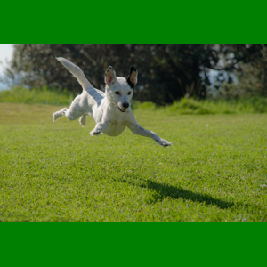
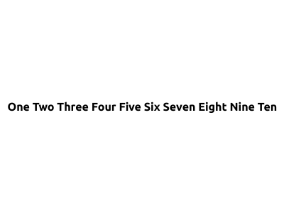

The first few image sources for the eInk Radiator project are going to be very simple. A single color, some text, an image. These will be the building blocks for other image generators later. These are the test-beds for the source repository structure, the testing methodology, and are composable for the rest of the image sources.

After building these first few image sources, I settled on some patterns. All image sources behave the same:

1.  They are simple CLIs with few or no external dependencies
2.  They take a config file that says what kind of image to make
3.  They take the height and width as arguments

### The most basic image source: a single color

I call it, the "[eInk Radiator Image Source Blank](https://github.com/petewall/eink-radiator-image-source-blank)". Ok, I'm an engineer, not a... pretty words naming guy. I wanted this one because:

1.  It's very useful to start with a simple project.
2.  It's very useful to spend time early on building the inputs and outputs of an image source.
3.  It will be useful for other image sources. For example, need a background color? Import this image source and use this.

It's orange

This beautiful image was created with:

`blank generate --config config.json --height 300 --width 400`

Where the config file is simply: `{"color": "orange"}`

### The next image source: images

This one's name is even worse: "[eInk Radiator Image Source Image](https://github.com/petewall/eink-radiator-image-source-image)". Obviously, displaying images will be important. The [previous post](__GHOST_URL__/eink-radiator-1-display/) showed a few images and how they'd be rendered on the eInk hardware. The display utility requires the image to be the right resolution, so the most important part for this image source is all about resizing.

There are three methods for resizing, loosely based on the `background-size` [property in CSS](https://www.w3schools.com/cssref/css3_pr_background-size.php):

1.  **Resize**: Simply scale both in height and width to smoosh or stretch the image to fit the desired resolution. This is simple, but will distort the image.
2.  **Cover**: Scale the image so that it covers the entire desired resolution. This will likely result in parts of the original image being cropped out.
3.  **Contain**: Scale the image so that the whole original image fits in the desired resolution. This will likely not fill the whole frame, so a background color can be set to fill what the resized image did not.

Look at that happy pup! Photo by [Ron Fung](https://unsplash.com/@oriz?utm_source=unsplash&utm_medium=referral&utm_content=creditCopyText) on [Unsplash](https://unsplash.com/photos/VQJXJ4IaU_o?utm_source=unsplash&utm_medium=referral&utm_content=creditCopyText). 

This image was generated by running:

`image generate --config config.json --height 300 --width 300`

Where the config file is:

    {
        "source": "https://github.com/petewall/eink-radiator-image-source-image/raw/main/test/dog2.jpg",
        "scale": "contain",
        "background": {
            "color": "green"
        }
    }

### The wordy image source: text

The last image source I've aptly named "[eInk Radiator Image Source Text](https://github.com/petewall/eink-radiator-image-source-text)". The simple idea is to render text onto an image. Simple enough, but the complexity comes in with the ability to set the font, the color, the size, and how to wrap text.

With a simple config file like this:

    text: One Two Three Four Five Six Seven Eight Nine Ten

The image source will format the text so it's all on one line, resized to be as large as possible:

While a config like this:

    text: |-
      Shields up!
      Rrrrrred Alert!
    color: red
    background:
      color: black
    font: UbuntuMono
    size: 48

Will result in an image like this:

While these image sources are not the most interesting, they're the start of a system that can be composed together. More to come!
