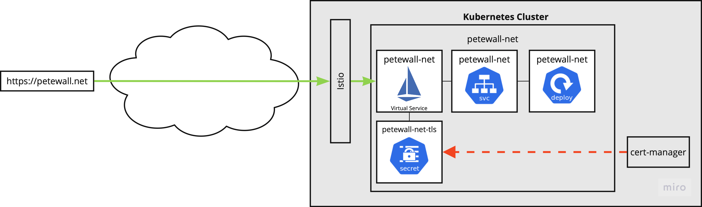

A few years ago, I wrote [Summoning Ghosts](/summoning-ghosts/) about standing up this blog on [Ghost](https://ghost.org/), running in my home lab Kubernetes cluster. At the time, it was a great excuse to exercise the cluster: a real workload with a database, dynamic DNS, automatic TLS, and an Ingress object I could point at. It worked. For years.

But over those years, the parts of the deployment I cared least about were the parts that needed the most attention: Ghost upgrades, database backups. And while the Ghost content management was nice, it made it harder to author posts and keep things going here.

So I busted the ghosts.



Compare this diagram to the one from the [original post](/summoning-ghost#ghost-deployment); so much simpler!

### Why Hugo

I wanted a few things from the replacement:

1.  **Content as files in git.** No database, no admin UI, no "export to JSON" dance when something goes wrong. I'm an engineer, so for most of my "content", the persistance layer is a git repository. Why not do the same thing here?
2.  **A static output.** I didn't need server-side rendering, comments, or accounts. So, there's an argument for simplification.
3.  **A theme I didn't have to design.** I am not a designer, and I was not going to become one for this.
4.  **Fast local previews.** `make serve` and I'm looking at the rendered post in a browser within a second.

[Hugo](https://gohugo.io/) checked all four boxes. The [PaperMod](https://github.com/adityatelange/hugo-PaperMod) theme checked the third one without me touching a stylesheet.

### Deploying a static site

This is the part that felt the best. The deployment shrunk from "a Helm chart's worth of YAML, a database, and a PVC" to a Dockerfile that's four lines long:

``` Dockerfile
FROM nginx:1.29-alpine

COPY nginx.conf /etc/nginx/conf.d/default.conf
COPY public /usr/share/nginx/html
```

That's the whole thing. `public/` is whatever `hugo` produces. The image is built and pushed to `ghcr.io` by a GitHub Actions workflow on every merge to `main`, and my cluster pulls the new tag. No more Ghost upgrade nights. No more Node.js CVE alerts to triage at 11pm. Nginx serves static files; that's what nginx is for.

A few quality-of-life additions I made on top of the bare nginx image:

- **Security headers.** HSTS, `X-Content-Type-Options`, `Referrer-Policy`, and a `Content-Security-Policy` that's strict but allows the bits I actually use.
- **A `/healthz` endpoint** so Kubernetes liveness probes don't have to fetch the homepage.
- **Host-portable `baseURL` rewriting.** Hugo bakes `https://petewall.net/` into the generated HTML, but I want the same image to work for PR previews on `petewall.github.io` without rebuilding. An nginx `sub_filter` rewrites that prefix at request time using `$http_host` and the forwarded scheme.

### PR previews for free

The other thing I got out of moving to a static site: cheap, throwaway preview environments. Every pull request triggers a workflow that builds the site and publishes it to `https://petewall.github.io/petewall.net/pr-<N>/`. Closing the PR cleans it up. With Ghost, "previewing a draft" meant logging into the admin UI on production. Now I can open a PR with a half-written post and read it on a real URL before I merge.

### Observability

I've been using [Grafana Faro](https://grafana.com/oss/faro/) inside the old page for a while, and I wanted to keep that going. It's given really nice insight into the health and performance of the website: page loads, web vitals, and any client-side errors get shipped to a Faro collector. The site is small, but it's nice to know whether anyone's actually hitting it and whether their browser is happy when they do.

### Final thoughts

The general lesson, again, is the one I keep relearning in the home lab: match the complexity of the tool to the complexity of the job. Ghost is a great CMS, but I did not need a CMS. I needed a way to render markdown into HTML and serve it. Hugo plus a static nginx image is exactly that, and the difference in operational overhead is enormous.

The site you're reading this on is now a single container, built from a directory of markdown files, deployed by a workflow that runs in under a minute. The ghosts are banished.

---

<small>Image by <a href="https://pixabay.com/users/aitoff-388338/?utm_source=link-attribution&utm_medium=referral&utm_campaign=image&utm_content=1515155">Andrew Martin</a> from <a href="https://pixabay.com//?utm_source=link-attribution&utm_medium=referral&utm_campaign=image&utm_content=1515155">Pixabay</a></small>
