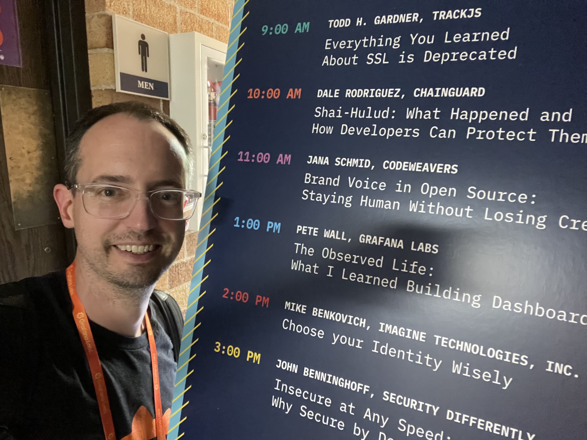
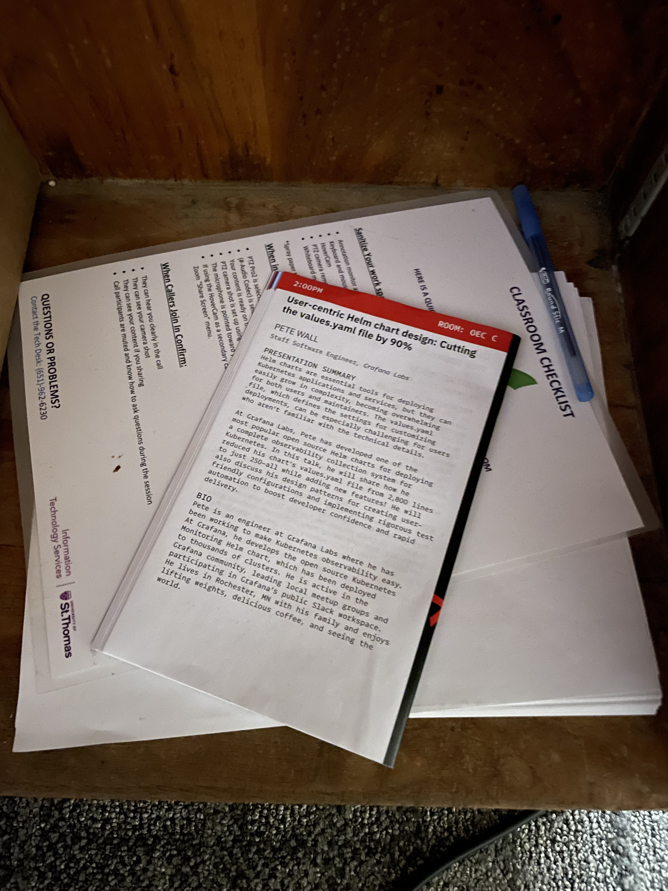

A couple of weeks ago, [I wrote](/posts/on-giving-talks) about my anxiety about giving a conference talk at Open Source North. Today, I want to provide an update, because I want to remember what happened and how I felt that day. Actually, the story starts the night before, when I drove up for the speaker happy hour. I saw some old faces and met many new people. One person I talked to was [Luke Schlangen](https://www.luke.mn), a developer advocate at Google, who's based in the Minnesota area. We both spoke at OSN last year, and I told him how I was feeling pretty good about how I did last time, and then I was followed by "the big developer advocate from Google!" He laughed and said "It's all about practice!"

## The setup

My talk was at 1:00. About an hour beforehand, I scarfed my lunch, headed over to the room, and started setting up my computer. As I was getting cables plugged in and the projector warmed up, I encountered my first hurdle: If I used two screens (laptop and projector), I wouldn't be able to see what's happening on the dashboards when I go to the demo, but if I mirrored the screens, I wouldn't be able to use my speaker notes. I'm trying hard to not rely on the speaker notes, but I still use them a bunch, especially for some critical parts that I really want to nail.

I decided to mirror, forgoing the speaker notes. "I'll just wing it!" I thought. Just as that feeling was starting to settle in, I looked down at the podium and I saw a program. Turns out, it was last year's OSN program, and it was even open to my talk. That's when I realized that I was in the same room I was a year ago! That was my good luck charm.

## How it went

I gave the talk. I felt shaky most of it and I could tell my voice was on the edge, but I pushed through. The jokes landed and people laughed. The demo worked and the AI agent built something, within time, that was impressive. Honestly, I felt like it went well.

After the talk, I had a handful of "nice talk!" comments, and a few people stayed and asked some great questions.

I then looked at the clock and realized that I wrapped this whole thing in 30 minutes. We're supposed to target 40 minutes per session, and I just did 25% less than that. I was consistently getting around 37-40 minutes in practice, so I don't know what happened. I was frantically thinking "did I skip content?" "Was I really speaking that fast?" I grabbed my laptop, found a quiet room and just sat for a moment.

I started my walk back to the Grafana booth, figuring I'd check in with my coworkers about how things were going there. When I walked up, they told me "The talk must have been good! We had a couple of people come up after the talk and say how much they liked it." Whoa! That was nice to hear. The rest of the afternoon, I spent at the booth. Someone came by who is a runner, and she told me how much she enjoyed the talk. We brainstormed about creating a dashboard around marathon training, which left her inspired. Then, near the end of the conference, as I was just walking around the happy hour, someone came up to me and said "I really enjoyed your talk!"

## What I learned

Many people told me that they enjoyed it, even when they didn't need to. That tells me they actually did, and weren't just being polite. I guess I am pretty good at this, and I feel like one of my strengths is being able to connect a story to something relevant and entertaining.

So, what do I take from this? A few points:

* I am my own worst critic.
* The preparation is still the hardest part.
* I should try to give the same talk in more places. That would help me with practice without forcing me to make new content every time.

So, I guess I have to come back to Vasil's statement from last time, "Do it at least three times." Well, this was my third time, so I guess I have to make a decision.

---

Cover photo and other photos by Pete Wall.
