Recently, I completed my final certification exam, which earned me the title of [Golden Kubestronaut](https://www.cncf.io/training/kubestronaut/)! This is a journey that started six years ago, and to complete it feels like a big accomplishment. It also feels very good to be done and to no longer have to spend my free time studying. In this post, I'll discuss the history around this process, my thoughts on the individual certifications themselves, and what I think this means going forward.

## History

I got my first Kubernetes certification in 2020. I was working at VMware, after they had just completed their acquisition of Pivotal Software. Many members of our team had been re-assigned, and others were being "beached". While waiting to find out what I was going to do, our manager mentioned that we should spend time learning, and maybe try getting some certifications. At this time, I had only occasionally used Kubernetes. It was that strange cluster thing that people had been talking about, but I never really "got it". I took up the offer and got my first one, the Certified Kubernetes Application Developer (CKAD). It really helped me understand not only Kubernetes itself, but the process of creating workloads to run on it. My next two came a year later, the Certified Kubernetes Administrator (CKA) and the Certified Kubernetes Security Specialist (CKS).

It's no surprise that I started building my home lab cluster a few months later. The goal then, and still now, was to learn how to build, use, and maintain a cluster, running workloads that are important enough to keep online. I'm proud to say that cluster is still running and still hosting this website.

## The first milestone

Fast-forward to 2024, and I'm attending KubeCon in Salt Lake City. I walked past the Linux Foundation's Learning Booth, where you can pick up special metal pins for each of the certifications you've earned, and I was thrilled to grab the three I had (after a recent re-certification for each). Then they said the fateful words: "You're only two away from being a Kubestronaut." Wait, what is that?

The [Kubestronaut program](https://www.cncf.io/training/kubestronaut/) is a special reward for those who have completed the five core Kubernetes certifications:

* [Kubernetes and Cloud Native Associate (KCNA)](https://training.linuxfoundation.org/certification/kubernetes-cloud-native-associate/), which covers the basics of Kubernetes, its purpose, and its place in cloud native computing.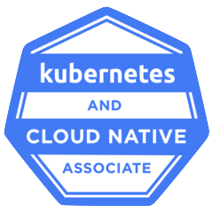
* [Kubernetes and Cloud Native Security Associate (KCSA)](https://training.linuxfoundation.org/certification/kubernetes-and-cloud-native-security-associate-kcsa/), which introduces security concepts within Kubernetes and how to secure your cluster and workloads.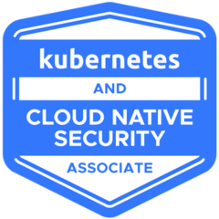
* [Certified Kubernetes Administrator (CKA)](https://training.linuxfoundation.org/certification/certified-kubernetes-administrator-cka/), which covers the administration of Kubernetes clusters, including upgrading nodes.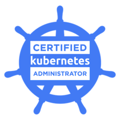
* [Certified Kubernetes Application Developer (CKAD)](https://training.linuxfoundation.org/certification/certified-kubernetes-application-developer-ckad/), which focuses on the workloads that run on Kubernetes.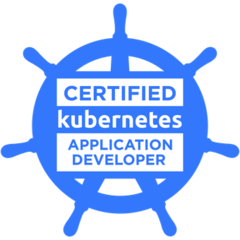
* [Certified Kubernetes Security Specialist (CKS)](https://training.linuxfoundation.org/certification/certified-kubernetes-security-specialist/), which builds on the KCSA and specializes in securing the cluster, detecting vulnerabilities, and mitigating risks.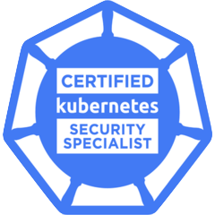

Once you've earned these certifications, you become a Kubestronaut, which provides recognition for a level of knowledge and proficiency in Kubernetes. It also comes with a sweet jacket! I earned this title only a month later, and at KubeCon 2025 in Atlanta, I joined the other Kubestronauts for an exclusive breakfast, followed by a picture on stage.

## Going for gold

I had some Learning and Development budget to spend in 2025, and with a coupon code from Atlanta KubeCon, I bought the [Golden Kubestronaut Bundle](https://training.linuxfoundation.org/certification/golden-kubestronaut-bundle/), which is exam credits for all sixteen certifications required. So that's eleven more I had to get, plus one that was going to expire (the CKS). Now, these exam credits expire in one year, so this meant I was embarking on trying to get one certification per month for the next year. Let's go! I knocked out cert after cert until my last one, a week ago.

## The certifications

Many of these certs go beyond core Kubernetes, exploring the specialized and common extensions to the base cluster. The exams are either multiple choice or hands-on, where you get real environments and perform real tasks. I'd like to briefly comment on my thoughts about each, in the order that I took them.

### PCA

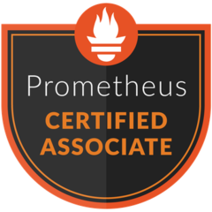Each certification beyond the original five explores some aspect of Kubernetes and platform engineering. The [Prometheus Certified Associate (PCA)](https://training.linuxfoundation.org/certification/prometheus-certified-associate/) is part of the observability aspect. Running a cluster is one thing, but if you're running it blind, it'll fail and you won't know until you can't get to the workload you need. I took this one first because I had already started learning much of Prometheus from being at Grafana Labs, so I had an advantage. I like it, even if I don't want to write an alerting rule ever again.

### LFCS

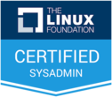Kubernetes nodes are nearly always running Linux, so having a good comprehension of how Linux works is useful. The [Linux Foundation Certified System Administrator (LFCS)](https://training.linuxfoundation.org/certification/linux-foundation-certified-sysadmin-lfcs/) isn't a Kubernetes certification, though, so it explores systems you'll likely not encounter otherwise. This one is hands-on, so it's best to really know and practice these things. I think my biggest frustration was with the portions running virtual machines, which is… not Kubernetes.

### CGOA & CAPA

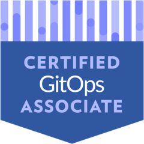I've been a fan of GitOps for a long time, so the [Certified GitOps Associate (CGOA)](https://training.linuxfoundation.org/certification/certified-gitops-associate-cgoa/) was a natural next step. GitOps is a strategy of storing everything related to the deployment, configuration, and even the infrastructure in Git repositories. That was a core strategy when I built this cluster. I like this cert.

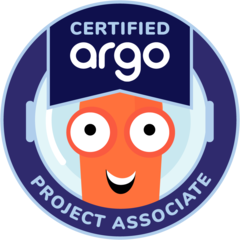The [Certified Argo Project Associate (CAPA)](https://training.linuxfoundation.org/certification/certified-argo-project-associate-capa/) was a natural follow-up to the CGOA, since Argo CD is a GitOps controller. It also covers the extensions, like Argo Rollouts and Workflows. This cert was advantageous because I've encountered users and customers who run Argo, and studying for it gave me a much better understanding of the system. I also get why people use these tools.

That said, on my little hobby cluster, I still run Flux for GitOps and use GitHub Actions for workflows.

### OTCA

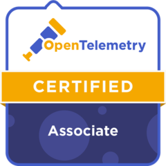Rounding out the observability track is the [OpenTelemetry Certified Associate (OTCA)](https://training.linuxfoundation.org/certification/opentelemetry-certified-associate-otca/). OpenTelemetry is hugely important, and while its history is based more in application telemetry, it's becoming the standard for all things monitoring and observability. Like the Prometheus cert, this one had a fair amount of overlap with my day job, but I appreciated going in depth on things like traces, spans, span events, and span logs.

### ICA

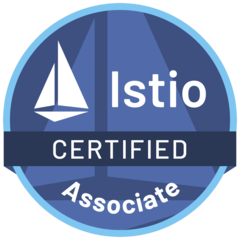Like the Argo certs, I wanted to get the [Istio Certified Associate (ICA)](https://training.linuxfoundation.org/certification/istio-certified-associate-ica/) because I've come across many other folks who run Istio. Istio is a combination of security and networking, really popularizing the concept of the service mesh sidecar. I enjoyed this one, because it really helped me understand the core concepts and how to develop software that works with Istio.

### KCA

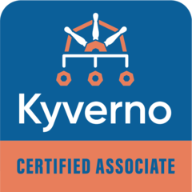I always thought that Kyverno had something to do with authentication and authorization. Maybe it was the "key" sound in the name. But then I figured it out: it's admission and mutation controllers on demand. Once that clicked, the [Kyverno Certified Associate (KCA)](https://training.linuxfoundation.org/certification/kyverno-certified-associate-kca/) made sense, though I don't think I'll be adding Kyverno to the home lab cluster anytime soon. It'd really make sense if you need to enforce policies.

### CBA

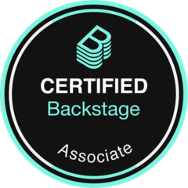Oh, Backstage. I've been hearing about Backstage for many years, and I was eager to see what the excitement was about. I've worked for places that use Backstage, and the promise of a "developer portal" with hooks for easy deployment APIs seemed great, but I never saw it fully realized. My biggest frustration with the [Certified Backstage Associate (CBA)](https://training.linuxfoundation.org/certification/certified-backstage-associate-cba/) was that it really needed React knowledge, and this one felt the least like a Kubernetes certification.

### CCA

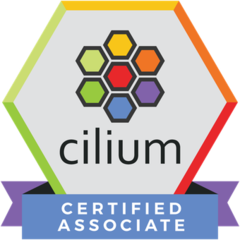The [Cilium Certified Associate (CCA)](https://training.linuxfoundation.org/certification/cilium-certified-associate-cca/) was the last one I was really interested in, because I thought it would be a good way to understand Kubernetes networking and CNIs. While I did learn about networking, it really is more focused on Cilium's features and how it works. This makes sense, so no marks off, but I still would like to learn more about the basics of Kubernetes networking.

### CNPA & CNPE

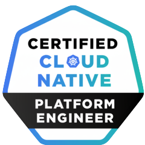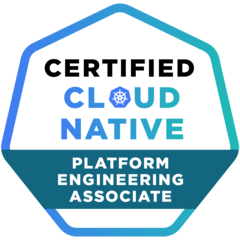I'm so glad that I took the [Cloud Native Platform Engineering Associate (CNPA)](https://training.linuxfoundation.org/certification/certified-cloud-native-platform-engineering-associate-cnpa/) and the [Certified Cloud Native Platform Engineer (CNPE)](https://training.linuxfoundation.org/certification/certified-cloud-native-platform-engineer-cnpe/) last. I wasn't aware, but they really feel like a summary of the previous certifications, and so much of what I learned from the earlier ones is important for these. They both cover platform engineering, meaning using the tools and systems from the previous certs to build a reliable, composable, and scalable developer platform. So they cover GitOps (think Argo CD), networking (think Cilium and Istio), policies (think Kyverno), and observability (think Prometheus and OpenTelemetry). These certs felt like a victory lap, since they were the final ones, but also because they were a summary of several years of learning.

## My takeaway

I spent a lot of time and money accomplishing this, and the natural question is: would I recommend it to others, and is it worth it? There's no solid answer to that, because the benefits I'll get from these certifications and the title of Golden Kubestronaut aren't directly measurable. It's not like these achievements will, by themselves, net me a sweet job, nor would I want to work for a company that hires solely on certifications. Thankfully, I already have a sweet job. But for me, it was a very structured way to learn about popular Kubernetes concepts, many of which I encounter while talking to real users and customers. I've gained a lot of confidence and useful knowledge that I can bring to those conversations. I also think it's a useful shorthand to demonstrate a base level of comprehension of these concepts, and that can be rewarding and useful.

If you want to learn Kubernetes, I'd recommend the KCNA and CKAD certifications. If you want to deepen that knowledge, then get the other three (KCSA, CKA, and CKS). At that point, you've got Kubestronaut status. From there, if you want to learn a specific area, get the certs for that area. But be warned: at that point, you're probably hooked on that rush you get when the email from the Linux Foundation arrives that says "Congratulations! You have successfully completed the exam!"

Plus, you get a nice jacket!


