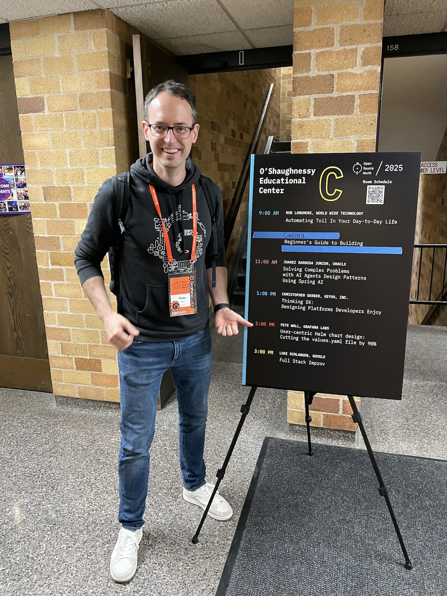
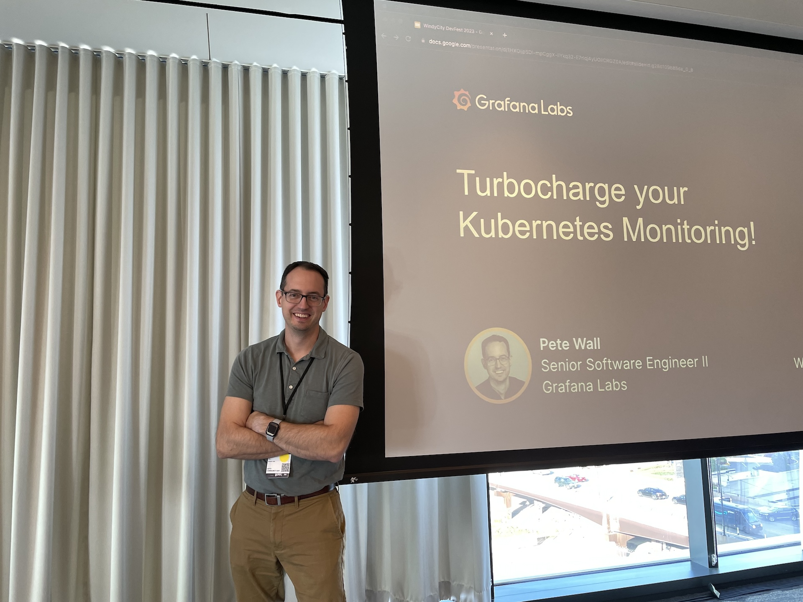

A collection of talks I've given at conferences and meetups.

### [The observed life: what I learned building dashboards for fun](https://opensourcenorth.com/presentations/The-observed-life-what-I-learned-building-dashboards-for-fun)

**Open Source North 2026** — May 28, 2026 — University of St. Thomas, St. Paul, MN

A tour of personal dashboard projects — home climate, mortgage tracking, gaming performance stats — and what they taught me about practical observability with Grafana, OpenTelemetry, Home Assistant, and where AI can actually be useful in the workflow.

### [User-centric Helm chart design: Cutting the values.yaml file by 90%](https://web.archive.org/web/20250523210019/https://opensourcenorth.com/presentations/user-centric-helm-chart-design-cutting-the-values-yaml-file-by-90)

**Open Source North 2025** — May 29, 2025 — University of St. Thomas, St. Paul, MN

Helm charts are essential for deploying Kubernetes applications, but they can grow in complexity, becoming overwhelming for both users and maintainers. The `values.yaml` file, which defines the settings for customizing deployments, can be especially challenging for users who aren't familiar with the technical details.

In this talk, I share how I reduced the Grafana Kubernetes Monitoring Helm chart's `values.yaml` from 2,800 lines to just 250 — all while adding new features — along with the design patterns and test automation that made it possible.

### [Turbocharge your K8s Infrastructure Monitoring!](https://youtu.be/M140Po-tnS8?t=190)

**Windy City DevFest 2023** — October 24, 2023 — Chicago, IL — [event page](https://gdg.community.dev/events/details/google-gdg-chicago-presents-windy-city-devfest-2023/)



*Me, hanging out with [Stephen Fluin](https://fluin.io/) and Leon Sorokin.*

Kubernetes clusters are now the preferred method for modern applications, but an app is only as reliable as its platform. This talk covers how to monitor your Kubernetes clusters using open source tools — Prometheus, Grafana, Loki, Mimir, Tempo, OpenTelemetry, and Grafana Agent — and how they combine into an excellent monitoring platform.
